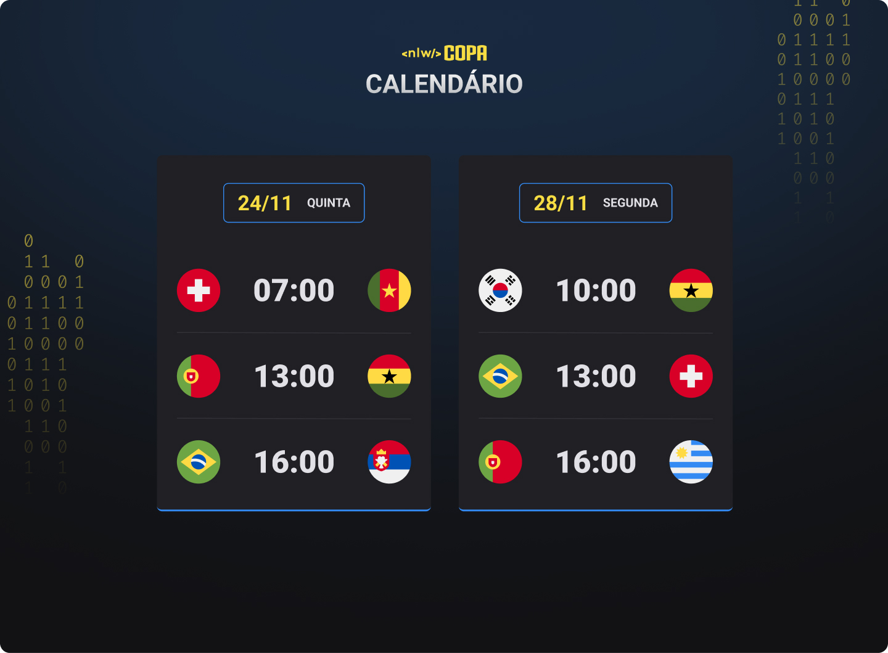

<h1 align="center"> NLW Explorer - Copa 2022 </h1>

Evento exclusivo e gratuito, promovido pela Rocketseat para ensino de tecnologias WEB.

  

 

## 🚀 Tecnologias

Esse projeto foi desenvolvido com as seguintes tecnologias:

- HTML e CSS
- JavaScript e JSON
- Git e GitHub

 

## 💻 Projeto

O projeto NLW Copa, apresenta o calendário da copa 2022.

 
